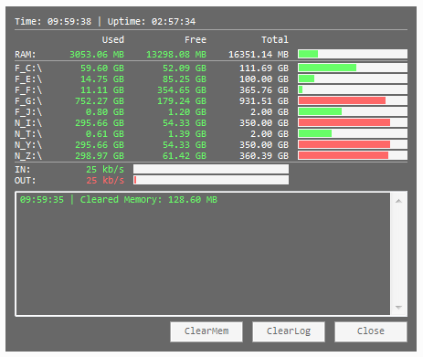

# htopmini by jNizM
Small System-Info Tool via AutoHotkey

  
## Features
* Weather: Location & Temperature
* Memory: RAM (Used, Free, Total)
* HDD: Fixed, Removable & Network Drives (Used, Free, Total)
* NetTraffic: IN & OUT (dont work 100%)
* Clear Memory

## Screenshot

## Info
* Version: v0.6.4
* URL: [AHK Thread](http://ahkscript.org/boards/viewtopic.php?f=6&t=254)

## Changelog
* 0.6.4 | Bugfixes
* 0.6.3 | Toggle Percentage in Progressbar
* 0.6.2 | Fixes Weather, Drag & Move
* 0.6.0 | Added Weather (Location & Temperature)
* 0.5.1 | Colored Progess for Memory & HDD
* 0.5.0 | Network Drives, Tray-Menu, DisplayBrightness
* 0.3.0 | First Release

## Contributing
* thanks to AutoHotkey Community