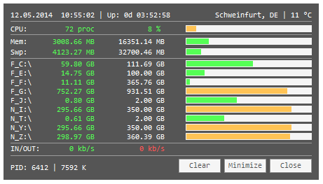

# htopmini by jNizM
Small System-Info Tool via AutoHotkey

  
## Features
* Time: Time & Uptime
* Weather: Location & Temperature
* Memory: RAM (Used, Free, Total & ProgressBar)
* HDD: Fixed, Removable & Network Drives (Used, Free, Total & ProgressBar)
* NetTraffic: IN & OUT (dont work 100%)
* Usage: PID & PrivatUsage Memory
* Clear Memory

## Screenshot

## Info
* Version: v0.8.2
* URL: [AHK Thread](http://ahkscript.org/boards/viewtopic.php?f=6&t=254)

## Changelog
* 0.8.2 | Click to open Drive in Explorer, Update Window
* 0.8.1 | Bugfixes & Improvements
* 0.8.0 | Clear Memory, Add SWP, Bugfixes
* 0.7.6 | Add CPU Load, Bugfixes
* 0.7.5 | Update with days
* 0.7.4 | Bugfixes & Improvements
* 0.7.3 | Bugfixes & Improvements
* 0.7.2 | Fix GlobalMemoryStatusEx()
* 0.7.1 | Fix GetProcessMemoryInfo
* 0.7.0 | Bugfixes, PID & PrivateUsage
* 0.6.4 | Bugfixes
* 0.6.3 | Toggle Percentage in Progressbar
* 0.6.2 | Fixes Weather, Drag & Move
* 0.6.0 | Added Weather (Location & Temperature)
* 0.5.1 | Colored Progess for Memory & HDD
* 0.5.0 | Network Drives, Tray-Menu, DisplayBrightness
* 0.3.0 | First Release

## Contributing
* thanks to AutoHotkey Community